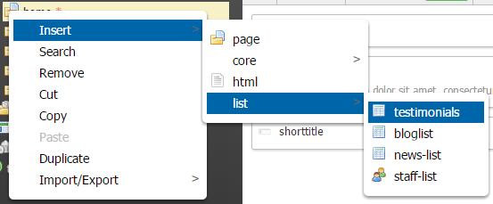

Getting started
===============

Please refer to our [WebPal Developer Guide](https://www.gitbook.com/book/palomino/webpaldev/details) for more information on how to use WebPal extensions

- Writing and extension
- GitHub integration

NOTE: 'extensions-essentials' is required for all WebPal extensions

Testimonial-list
================

Plugin for WebPal-powered applications

A testimonial-list is a list of testimonials kept in an editable table with options to format its layout

Simply add this plugin to your WebPal extensions

Insert a testimonial-list into a page you are creating

